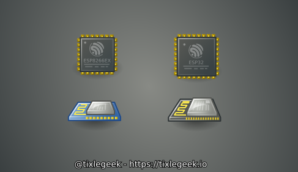
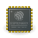
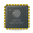

# Tango-icon-espressif
Tango style icons for espressif chips and modules (svg)

made with love by [@tixlegeek](https://twitter.com/tixlegeek) - https://tixlegeek.io

## ESP8266

### ESP8266 module

### ESP8266 chip

## ESP32

### ESP32 module

### ESP32 chip

